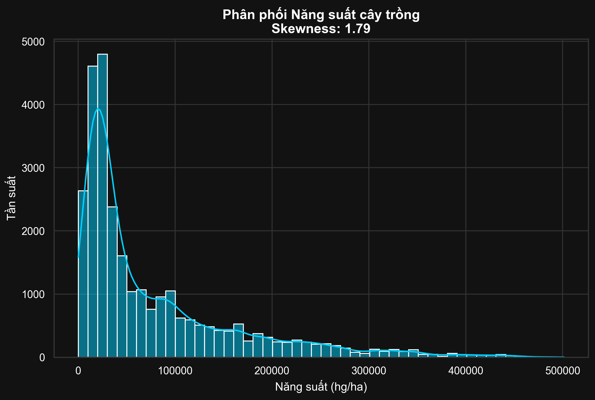
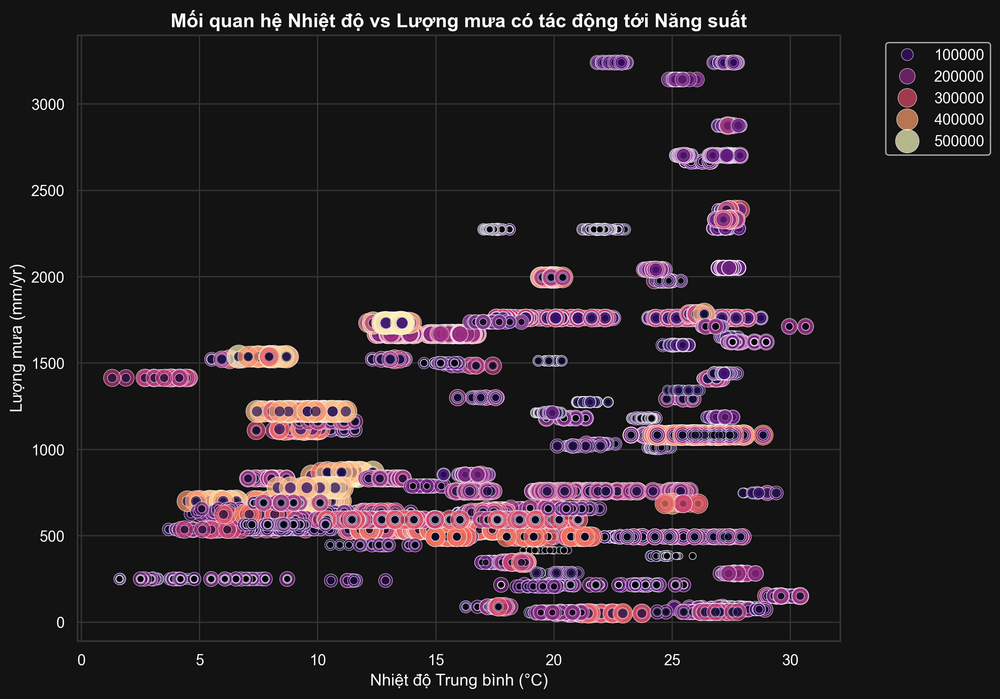
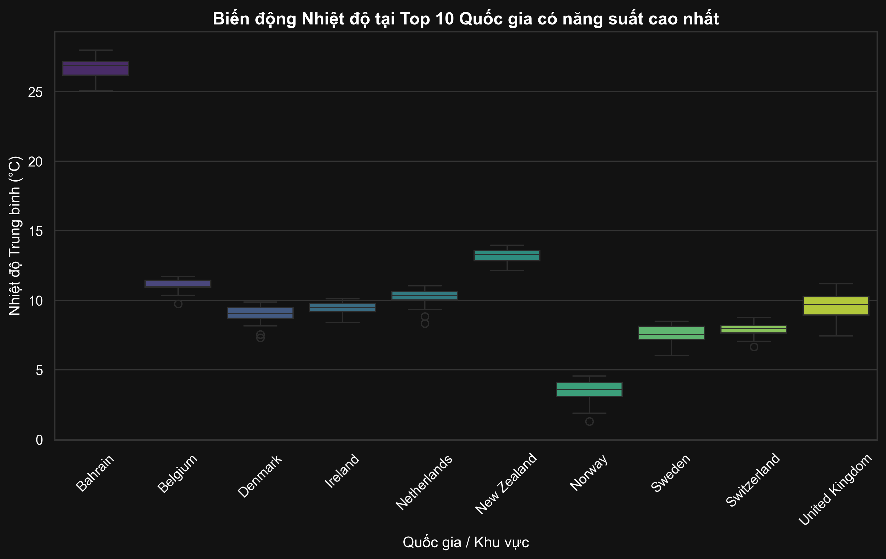

# Chương 1: Đặt vấn đề và Phân tích Yêu cầu

## 1.1. Bối cảnh & Mục tiêu (Business Context & Goals)
**Bối cảnh:** Nông nghiệp và Biến đổi khí hậu đang là những chủ đề nóng bỏng. Việc sản lượng mùa màng bị thâm hụt (Low Yield) đe dọa trực tiếp đến an ninh lương thực toàn cầu. Hằng năm, nông dân mất trắng do không lường trước được sự phản ứng của cây trồng khi gặp cú sốc sinh thái (Lượng mưa bất thường, chênh lệch nhiệt độ).
**Mục tiêu:** Xây dựng một đường ống (Pipeline) Khai phá dữ liệu và Học máy tự động (Vibe Coding) để:
1. Phát hiện sớm các luật khí hậu - sinh học gây ảnh hưởng năng suất.
2. Dự đoán Năng suất (Classification cho mức rủi ro, và Regression cho sản lượng cụ thể) từ thông số Môi trường (Nhiệt, Mưa) và Chăm sóc (Phân thuốc).
**Tiêu chí thành công:** Hệ thống vạch ra được "Ảo giác đánh giá chéo" (CV Illusion - Data Leakage), đồng thời vượt qua các đường cơ sở (Baseline) ở cả hai bài toán: F1-Macro > 0.6 cho Phân lớp, và MAE phòng chống rò rỉ cho chuỗi Time-Series.

## 1.2. Mô tả Dữ liệu và Từ điển (Data Dictionary)
**Nguồn dữ liệu:** Bộ dữ liệu `yield_df.csv` được thu thập từ Kaggle (Crop Yield datasets) với các biến quan sát từ FAO. Đây là chuỗi thời gian quốc gia chi tiết.

| Cột (Feature) | Ý nghĩa (Trọng số) | Kiểu dữ liệu | Vai trò |
|---|---|---|---|
| `Area` | Tên Quốc gia / Biến số tính không gian | Categorical | Phân mảnh địa lý |
| `Item` | Loại cây lai trồng (VD: Gạo, Lúa Mì, Khoai) | Categorical | Phân mảnh sinh lý học |
| `Year` | Năm thu hoạch ghi nhận | Mốc thời gian | Trục Time-Series (Chống Leakage) |
| `average_rain_fall_mm_per_year` | Lượng mưa trung bình năm (mm) | Numeric | Feature Khí tượng học |
| `avg_temp` | Nhiệt độ bình quân / Nền nhiệt độ (độ C) | Numeric | Feature Khí tượng học |
| `pesticides_tonnes` | Khối lượng thuốc trừ sâu sử dụng (Tấn) | Numeric | Feature Hoá học (Đầu tư NVL) |
| `hg/ha_yield` | Sản lượng Cây trồng (Hectogram/Hectar) | Numeric | **[TARGET] Mục tiêu phân tích** |

**Phân tích Rủi ro Dữ liệu (Data Risks):**
- **Data Leakage (Rò rỉ tương lai):** Lỗi kinh điển của các bài nghiên cứu chuỗi là Split ngẫu nhiên bằng `test_size=0.2`. Việc xáo trộn sẽ khiến thuật toán biết năng suất năm tiếp theo để bù đắp cho năm trước. Pipeline xử lý triết để bằng phương pháp `TimeSeriesSplit` khắc khe.
- **Outlier / Imbalance (Bất đối xứng):** Năng suất ngô ở Mỹ cực lớn so với diện tích Châu Phi -> Sinh ra nhiễu độ dốc. Đã xử lý bằng quy chuẩn `Z-score StandardScaler` và dàn phẳng Categorical One-hots/Dummies. Lớp cực yếu (Low Yield) sẽ gánh chịu lệch pha nếu dùng Accuracy, dự án áp dụng chuẩn F1-Macro thay thế.

## 1.3. Khám phá Dữ liệu (EDA - Exploratory Data Analysis)
Quá trình EDA được diễn giải chi tiết thống kê ở Notebook 01 với 3 đồ thị phân tích sâu (Deep Analytics):

1. **Biểu đồ Phân phối Năng suất (Yield Distribution)**: 
   Sự lệch phải (Right-skewness / Kurtosis) cực độ cảnh báo tình trạng đói kém năng suất ở phần đông diện tích thế giới, làm chìm lấp các kỷ lục điểm của các vùng chuyên canh hoa màu lớn.
   

2. **Cộng hưởng Thời tiết trên Bản đồ điểm (Scatter T-R-Y)**:
   Điểm giao thoa (Interaction) giữa Nhiệt độ và Lượng mưa. Insight nổi lên là: Vùng "Mưa xấp xỉ 2000-3000mm và Nhiệt quanh 25 độ" lại có thể làm rễ cây ngập úng cực mạnh, dìm sản lượng ngang bằng hoang mạc.
   

3. **Gương mặt Chảo lửa (Top 10 Hottest Countries vs Phân thuốc)**:
   Boxplot biểu thị rải nhiệt của 10 nước thiêu đốt nhất xích đạo. Sự thiếu hụt trầm trọng Hoá chất Canh tác (Pesticide) đang phản ánh bản chất nghèo đói - nóng bức kìm kẹp kinh tế toàn diện của họ.
   
