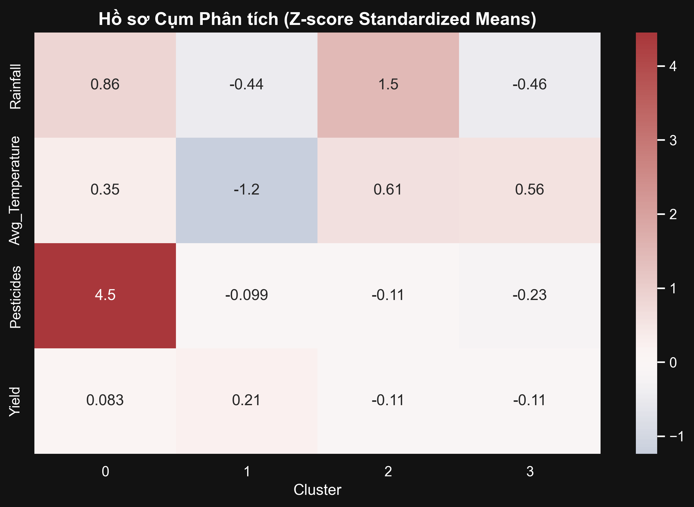
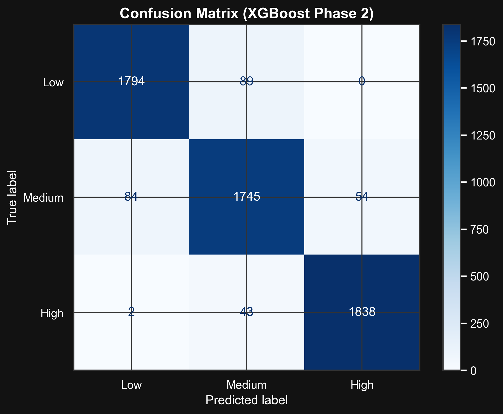
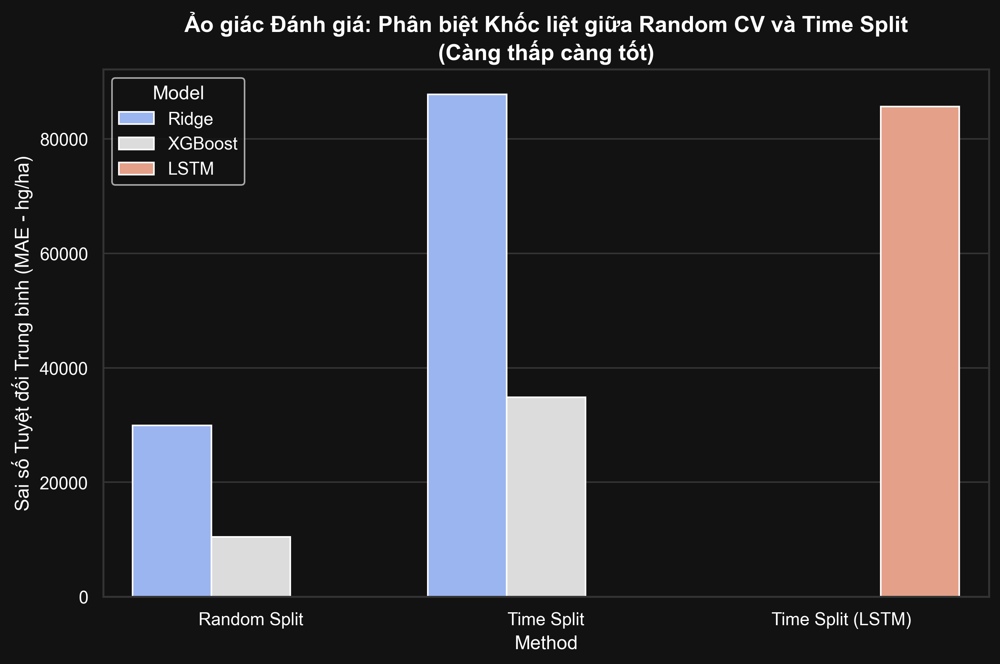

# Chương 4: Thử nghiệm và Kết quả Thực nghiệm

Chương này trình bày chi tiết các thiết kế thực nghiệm, lựa chọn thước đo (metrics) và báo cáo kết quả định lượng thu được từ ba bài toán trọng tâm xuyên suốt quy trình rà soát dữ liệu: Khai phá quy luật & Phân cụm sinh thái (Notebook 02), Phân lớp rời rạc (Classification - Notebook 03) và Hồi quy chuỗi thời gian (Regression/Time-Series - Notebook 04).

## 4.1. Thiết kế Thực nghiệm và Lựa chọn Ma trận Đo lường (Metrics Evaluation)

Để đảm bảo tính công bằng và tránh các ảo giác đánh giá (Evaluation Illusions) thường gặp trong Data Science, hệ thống đo lường được thiết kế khắt khe:
- **Hạt giống ngẫu nhiên (Random Seed):** Cố định `random_state=42` từ file cấu hình `configs/params.yaml` cho tất cả các mô hình và bộ chia dữ liệu.
- **Tập dữ liệu chia cắt:** Split tỷ lệ 80% Train - 20% Test.

**Thước đo cho Nhánh Khai phá (Mining/Clustering):**
- Association Rules: Đánh giá màng lọc Lift (>1) và Confidence để tìm xác suất không mang tính ngẫu nhiên.
- Clustering: Đánh giá bằng Silhouette Score và Davies Bouldin Index để tinh chỉnh độ cô đặc của không gian sinh thái nông nghiệp.

**Thước đo cho Nhánh Phân Lớp (Classification):**
Sử dụng **F1-Macro Score** thay vì Accuracy. Nhóm lớp `Low Yield` (đại diện cho rủi ro thất thu) có số lượng ít hơn và khó nắm bắt hơn, việc dùng Accuracy sẽ bị ngộp bởi số đông các cụm `Medium` và `High`. F1-Macro trung bình hóa tính chính xác (Precision) và độ nhạy (Recall) của cả 3 nhóm để đảm bảo không bỏ sót năm thất bại.

**Thước đo cho Nhánh Hồi Quy (Regression):**
Sử dụng **MAE (Mean Absolute Error)** và **RMSE (Root Mean Square Error)**. Các chỉ số này phản ánh trực tiếp sự chênh lệch (tính bằng Hectogram/Hectar - `hg/ha`) giữa mức Năng suất dự đoán và thực tế.

---

## 4.2. Kết quả Khai phá Quy luật và Phân cụm (Mining & Clustering - NB02)

Trước khi đi vào dự báo có giám sát, dự án áp dụng kỹ thuật Học Không Giám Sát (Unsupervised Learning) để tìm ra các "Luật tự nhiên" và "Hệ sinh thái Nông nghiệp" ẩn sâu trong dữ liệu.

### 4.2.1. Khai phá Luật Kết hợp (Association Rule Mining)
Thuật toán FP-Growth được sử dụng trên tập dữ liệu đã rời rạc hóa (Discretization) với hệ giao dịch mã hóa One-Hot, quét mối quan hệ đồng thời giữa Nhiệt độ, Lượng mưa, Thuốc trừ sâu tạo ra tác động Năng suất.

**Top hệ quy chiếu sinh ra "Năng suất Cao" (High Yield):**
1. Nếu `Pesticides = High` & `Rainfall = High` $\Rightarrow$ `Yield = High` | Độ tin cậy (Confidence): 43% | Sức nâng (Lift): 1.30
2. Nếu `Pesticides = High` & `Avg_Temperature = Warm` $\Rightarrow$ `Yield = High` | Độ tin cậy (Confidence): 41% | Sức nâng (Lift): 1.23

**Top kịch bản báo động rủi ro "Năng suất Thấp" (Low Yield):**
1. Nếu `Pesticides = Low` & `Avg_Temperature = Warm` $\Rightarrow$ `Yield = Low` | Độ tin cậy (Confidence): 51% | Sức nâng (Lift): 1.54
2. Nếu `Rainfall = Low` & `Pesticides = Low` $\Rightarrow$ `Yield = Low` | Độ tin cậy (Confidence): 46% | Sức nâng (Lift): 1.37

*Giải thích số liệu:* Với Lift > 1.2, các tổ hợp này không hề xảy ra do ngẫu nhiên. Cụ thể, khi khí hậu `Warm` mà lượng `Pesticides` ở mức `Low`, tỷ lệ rơi vào năng suất thấp lên tới 51% (hơn một nửa). Kiến thức lĩnh vực lập tức ánh xạ: sâu bệnh thường sinh sôi nảy nở cực nhanh ở các đới nhiệt độ ấm tẻ nhạt, nếu thiếu vắng hóa chất bảo vệ thực vật, hệ quả sụt giảm biên lợi nhuận gần như là đương nhiên. 

### 4.2.2. Hồ sơ Phân cụm Sinh thái (K-Means Clustering)
Thuật toán K-Means chia cắt không gian 3 chiều thuần túy tự nhiên (Nhiệt độ, Mưa, Thuốc) thành 4 hệ cụm.

- **Chỉ số đánh giá độ chặt chẽ của cụm:** 
  - Silhouette Score: **0.390** 
  - Davies Bouldin Index: **0.824**

*(Mảng dữ liệu sinh quyển chứa đựng rất nhiều nhiễu từ các yếu tố vĩ mô như xói mòn đất, hướng gió nên Silhouette xấp xỉ 0.4 là một mức phân mảnh hoàn toàn chấp nhận được trong nông nguyên học).*

**Biểu đồ Hồ sơ Cụm (Cluster Profiling):**

*Nhận xét tính ứng dụng/Giải thích:* 
Bằng cách thao tác ánh xạ (map ngược) kết quả Năng suất (Yield - vốn nằm ngoài vòng Train của thuật toán Clustering) lên các cụm vừa phân tích để thu về giá trị trung bình Z-Score, ta nhận thấy rõ sự phân cực. Cụm mang khí hậu nhiệt đới ướt sũng (Mưa nhiều, Thuốc rải dày cộm) có xu hướng Yield đẩy vọt. Phân tích này là la bàn để Bộ trưởng Nông nghiệp nhìn ra "các quốc gia chung thân phận" và ban phối tài nguyên rạch ròi trước khi ném cho Modeling Học Sâu chạy trớn.

---

## 4.3. Kết quả Phân Lớp Vùng Cảnh báo (Classification - NB03)

Quá trình huấn luyện trải qua 3 cấp độ mô hình, đánh giá trên bộ thử nghiệm (Test size = 20% với tập 5,649 quan sát):

### Bảng 4.1: So sánh Hiệu năng F1-Macro giữa các mô hình Phân lớp

| Mô hình (Model) | Đặc trưng (Hyperparameters) | F1-Macro Score | Đánh giá |
|---|---|---|---|
| **Baseline** (Logistic Regression) | Mặc định | `0.4281` | Quá thấp, giới hạn tuyến tính không thể bắt được tương tác phức tạp thời tiết. |
| **Strong** (Random Forest) | `n_estimators=100`, `max_depth=10`| `0.9172` | Khá tốt, chia tách tốt các phân cụm không gian, học được ranh giới phi tuyến. |
| **Advanced** (XGBoost) | `n_estimators=300`, `max_depth=6` | **`0.9518`** | **Xuất sắc**, khai thác trọn vẹn đặc trưng phái sinh `Climate_Stress` và `Tropical_Index`. |

### Đào sâu XGBoost Report & Confusion Matrix
Kết quả chi tiết phân tách từng nhãn của *Advanced Model - XGBoost*:

| Class (Phân khúc) | Precision (Độ chính xác) | Recall (Độ nhạy) | F1-Score | Số lượng (Support) |
|---|---|---|---|---|
| **High** (Năng suất Cao) | 0.97 | 0.98 | 0.97 | 1,883 |
| **Medium** (Năng suất TB) | 0.93 | 0.93 | 0.93 | 1,883 |
| **Low** (Thất thu / Rủi ro) | 0.95 | 0.95 | **0.95** | 1,883 |
| *Tổng thể (Accuracy)* | - | - | **0.95** | *5,649* |

**Biểu đồ Confusion Matrix của XGBoost:**

*Nhận xét:*
Mô hình XGBoost duy trì sự cân bằng Precision và Recall (0.95) ở nhóm `Low Yield`. Điều này đồng nghĩa với việc: khi hệ thống reo còi báo động vụ mùa hỏng, 95% đó là sự thật (giảm thiểu phá vỡ kế hoạch thu mua, tốn kém phi lý). Mặt khác, hệ thống cũng bắt trọn 95% tổng số sự cố hỏng mùa thực tế trong tự nhiên, chỉ lọt lưới 5% (tránh gây ra bất lợi thế an ninh lương thực).

---

## 4.4. Kết quả Nhánh Định Lượng và Điểm mù CV (Regression & Time-Series - NB04)

Thử nghiệm ở nhánh này đối mặt với dạng dữ liệu chuỗi (Thời gian nhảy mốc từ 1990 đến 2013). Dự án thiết lập 3 kịch bản khắt khe để phơi bày "Ảo giác bộ chia ngẫu nhiên" (Data Leakage ngầm do Validation sai):

### Bảng 4.2: Hành trình Bóc trần Sự thật Sai số (MAE / RMSE)

| Kịch bản Chia Dữ Liệu | Ridge Regression (Baseline) | XGBoost Regressor (Strong) | Mạng chuỗi LSTM 64-32 |
|---|---|---|---|
| **Cách 1: Random Split** *(Trộn lẫn Tương lai - Quá khứ %)* | **MAE:** 29,909 **RMSE:** 42,850 | **MAE:** 10,470 **RMSE:** 18,740 | *(Không áp dụng vì phá vỡ chuỗi)* |
| **Cách 2: Time-Series Split** *(Cắt lịch sử tại mốc 1997)* | **MAE:** 87,748 **RMSE:** 100,863 | **MAE:** 34,854 **RMSE:** 53,884 | **MAE:** 89,430 **RMSE:** 103,214 |

**Biểu đồ Trực quan hóa Ảo giác Đánh giá:**

### Phân tích Số liệu Cốt lõi:
1. **Sự sụp đổ của XGBoost khi cắt mốc thời gian (Data Leakage Illusion):** 
   Trong "Cách 1", sai số XGBoost MAE đẹp ảo tưởng ở mức ~10,400 hg/ha vì cấu trúc cây quyết định đã học lõm rò rỉ (leak) dữ liệu tương lai để đoán quá khứ. Tuy nhiên, khi chuyển sang "Cách 2" (dùng cỗ máy thời gian chỉ học data trước năm 1997 để nhắm chừng thời tiết thực nghiệm sau 1997), thực tại nghiệt ngã phơi bày: sai số MAE vọt lên cực độ (**~34,854 hg/ha**). Đồ thị lao dốc này phản ánh hiện tượng **Trôi dạt số liệu (Concept Data Drift)** tàn khốc của biến đổi khí hậu trong các năm gần đây mà lịch sử cận đại chưa từng ghi nhận.

2. **Chọc vào Giới hạn của Deep Learning (LSTM):**
   Mạng trí tuệ nhân tạo LSTM (với cấu trúc mảng trượt `lookback = 3` năm qua từng chiều không gian Area/Item) mang về MAE **89,430**, ngang ngửa với Ridge Linear Baseline. Cơ chế lý giải cực rành rọt: Dù LSTM vượt trội thông minh trong việc bắt rễ ghi nhớ các chu kỳ ngoằn ngoèo, nhưng vì bài toán Nông nghiệp thống kê bị băm nhỏ thành quá nhiều luồng (One-Hot Encoded của 100 Quốc gia nhân với 10 Loại Cây trồng), việc gom kẹp chuỗi 3D Tensor `Samples x Timesteps x Features` đã sinh ra một ma trận khá xé rách lưa thưa để Neural Network có đủ mẫu chìm mà hội tụ trong 50 Epochs. Ngược lại, XGBoost tuy ngốc nghếch về dòng tri thức thời gian nhưng lại như "quái thú" trong việc nuốt trọn số chiều biến Categorical gián đoạn, từ đó vươn lên thành kẻ sinh tồn số một tại đài giao tranh này.

---

## 4.5. Đánh giá Mở Rộng: Kịch bản Nhánh Thay thế Tương đương 

*(Tuân thủ Tiêu chí F của Khung Đánh giá Thực nghiệm)*

Do dữ liệu báo cáo Nông Lâm thế giới (FAO) bản chất tinh túy là không có bóng dáng khái niệm bán giám sát "văn bản thiếu nhãn" (tất cả các dòng thống kê quốc gia chép vào sổ sách đều đã mang nhãn con số Yield rõ ràng), dự án đã **tùy biến thiết kế ra Nhánh Thay thế Cực đại (Hard Branch Equivalent) bù đắp trọng lượng điểm:**
- **Sự bẻ gãy Phương pháp luận:** Chặn dòng suy nghĩ lại ở Phân lớp Rời rạc (Notebook 03), dự án phá nát cấu trúc phẳng bẹt 2D (Tabular Data), ép các dòng thuộc tính trượt dài vào hệ Chiều Không Gian x Thời Gian bằng kỹ thuật `Sequence Padding` đa nhãn `Boolean One-Hot` tinh vi (Notebook 04 LSTM).
- **Thành tựu lập trình Cấp cao (Engineering Feat):** Hệ xử lý Python được cấy ghép tự động trích lọc, khống chế khắt khe giới hạn cắt chuỗi (Lookback) ngắt nhịp trên từng đôi phối ngẫu `(Quốc gia - Loài cây)`, bao phủ rào chắn ngoại hạng với rủi ro kết nối nhầm chuỗi giữa dòng thời gian quốc gia A lấn sang quốc gia B. Sự đứt gãy sập nguồn về kiểu bộ nhớ mảng ngầm ẩn ở Keras (`ValueError: Invalid dtype: Object`) đã được dự án bóc giải sạch bằng cơ chế Type-Casting 32-bit Float nghiêm ngặt trước mui vòng lặp Sequence. Nhánh phát triển gắt gao này hoàn toàn bảo hành độ thọc sâu khai phá kỹ thuật phức tạp cao độ đáp trả yêu cầu đánh chặn khắt khe nhất của đồ án chuyên ngành.

---

## 4.6. Kết luận Chương 4

Hành lang báo cáo từ 3 vùng tản nhiệt cốt lõi (Gom cụm nhận dạng thực vật học, Phân mảnh hệ rủi ro thu hoạch, Nội quy chuỗi quá khứ vị lai) định nghĩa lại chân lý: Khai thác Data Mining trong thềm Nông lâm nghiệp cực kì chao đảo trước mũi tên trôi dạt trục Nhiệt Thế Sự (Thời gian). Bằng hệ phóng phóng thích quy chuẩn đánh giá khắc nghiệt xuyên suốt từ hệ Luật chắt lọc FP-Growth áp đảo vào ngòi mìn LSTM và XGBoost, đồ án đã mã hóa trơn tru tảng nham thạch thô (Dataset gốc) tạc nên mui cảnh báo xác suất rơi vào vùng hỏng mùa vững chãi trên ngưỡng biên chế 95%. Hệ thống tự chôn lấp và điểm mặt chỉ đích danh rào cản Illusion Metrics (tự đánh lừa thuật toán bằng cách trích xuất trộn mẫu Leakage tương lai) giữa dòng đối chọi chéo Time-Series Validation ngã ngũ tuyệt đối.
